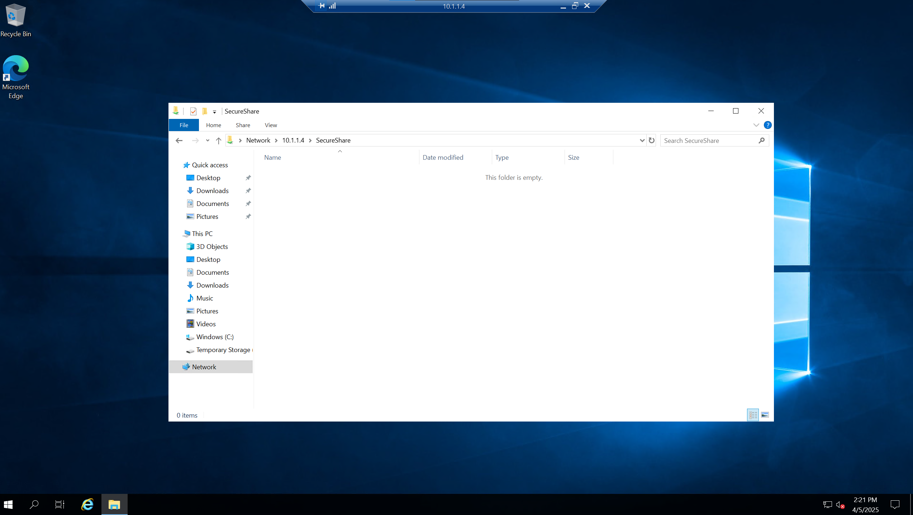

# SMB-over-VPN (Server Message Block)

This project demonstrates how to securely share files over a VPN using Server Message Block (SMB) within a Zero Trust architecture.

## Project Overview

- Deployed a Windows VM with no public IP.
- Connected to it through a secure Point-to-Site VPN.
- Enabled SMB file sharing for internal users only.
- Verified access via private IP and ensured AD DS visibility.

## Key Technologies

- Azure Virtual Network Gateway (P2S)
- Azure VPN Client with Cert-Based Auth
- Network Security Groups (NSG)
- SMB (Server Message Block)
- Windows Server + Active Directory Domain Services

## Screenshot

---

### Real-World Use Case

Used in secure environments (for example, federal or enterprise) to allow internal users to access file shares over VPN—without exposing the VM to the internet.

